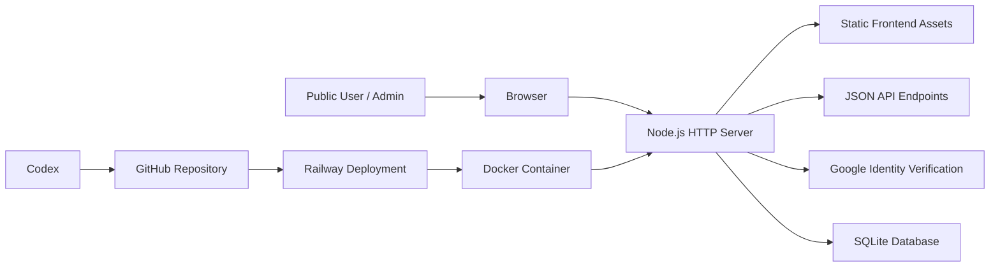

# Architecture

## Overview

The Sustainable Eating Assessment Tool (SEAT) is a small full-stack web application for browsing and administering URI dining hall food entries. It is intentionally lightweight: a single Node.js server renders static frontend assets, exposes a JSON API, manages Google-authenticated admin sessions, and persists data in SQLite.

At a high level, the system looks like this:

## Tech Stack

- `Node.js`: backend runtime and HTTP server
- `JavaScript`: backend and frontend application code
- `SQLite`: persistent relational database for food entries, users, and sessions
- `Docker`: containerized deployment target used by Railway
- `Railway`: production hosting platform
- `GitHub`: source control, collaboration, and deploy source for Railway
- `Codex`: AI-assisted development environment used to scaffold, refactor, document, and iterate on the app

## Application Layers

### Frontend

The frontend is a static client served directly by the Node server.

- Public UI:
  - [public/index.html](/Users/miketedeschi/dev/uri-seat/public/index.html)
  - [public/app.js](/Users/miketedeschi/dev/uri-seat/public/app.js)
  - [public/styles.css](/Users/miketedeschi/dev/uri-seat/public/styles.css)
- Admin UI:
  - [public/admin.html](/Users/miketedeschi/dev/uri-seat/public/admin.html)
  - [public/admin.js](/Users/miketedeschi/dev/uri-seat/public/admin.js)
- Shared client helpers:
  - [public/shared.js](/Users/miketedeschi/dev/uri-seat/public/shared.js)

The public page supports search and item inspection. The admin page supports Google-authenticated CRUD and CSV import.

### Backend

The backend lives primarily in [server.js](/Users/miketedeschi/dev/uri-seat/server.js). It is responsible for:

- serving static files
- exposing JSON endpoints
- validating and normalizing input
- calculating derived nutrition, environmental, and sustainability fields
- verifying Google sign-in tokens
- creating and clearing signed session cookies
- reading and writing SQLite data

There is no separate framework layer like Express in the current implementation. The app uses Node’s built-in HTTP server directly.

### Database

The production data model is SQLite-based and currently includes:

- `food_entries`: main application data
- `users`: Google-authenticated user records
- `sessions`: server-managed login sessions

The app stores raw nutrition and environmental inputs, then calculates derived scores such as:

- `nutrient_rich_food_index`
- `nutrition_composite_score`
- `environmental_composite_score`
- `sustainability_index`

## Deployment Model

Production is currently deployed on Railway.

### Deploy Flow

1. Code is maintained in GitHub.
2. Railway builds the app from the repo using [Dockerfile](/Users/miketedeschi/dev/uri-seat/Dockerfile).
3. The container starts the app via [start.sh](/Users/miketedeschi/dev/uri-seat/start.sh).
4. Runtime configuration is provided through environment variables such as:
   - `GOOGLE_CLIENT_ID`
   - `SESSION_SECRET`
   - `ADMIN_EMAILS`
   - `NODE_ENV`
   - `DB_PATH`
5. SQLite persists on a Railway volume mounted outside the container image.

### Why Docker Matters Here

Docker is important because the app depends on the `sqlite3` CLI at runtime. The Docker image ensures that dependency is present consistently in production.

## Current Design Characteristics

### Strengths

- Very small operational footprint
- Easy local development
- Minimal moving parts
- Straightforward deploy story
- Clear separation between public browsing and admin management

### Tradeoffs

- Single-process architecture
- SQLite is best suited to one-instance deployment
- Backend logic is concentrated in one main server file
- No formal migrations framework yet
- No automated test suite yet

## Current Production Shape

As built today, the system is best understood as:

- a lightweight university research app
- backed by SQLite
- deployed as one Railway service
- versioned in GitHub
- developed iteratively with Codex support

That architecture is intentionally simple, inexpensive, and easy to evolve further as the project grows.
